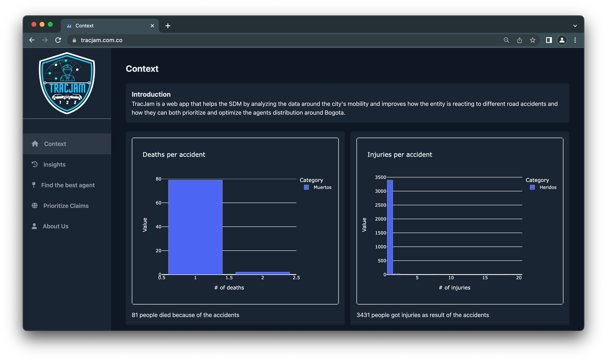
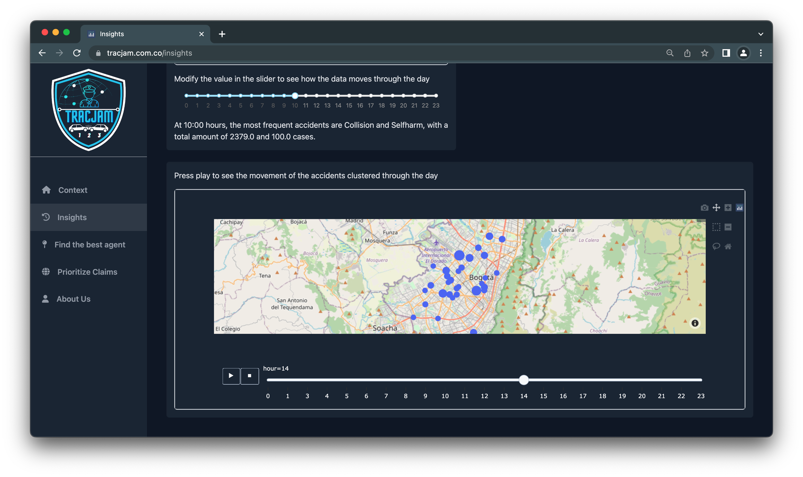
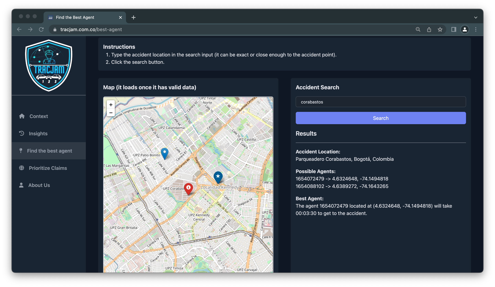
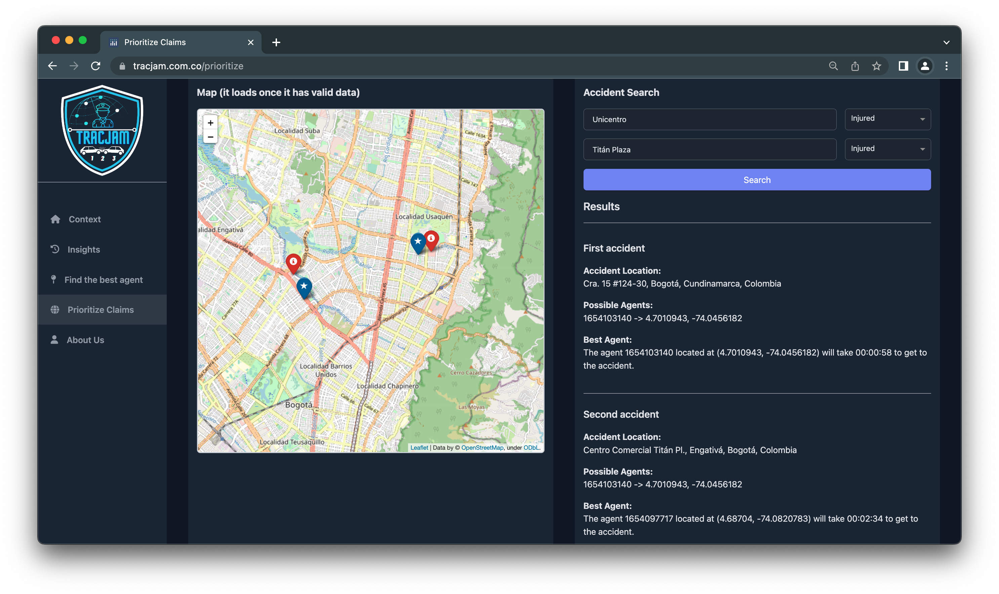

<div id="top"></div>

<!-- PROJECT LOGO -->
<!-- <br /> -->
<div align="center">
  <a href="https://github.com/hrodriguezgi/ds4a-team23">
    
  </a>

<h3 align="center">Tracjam</h3>

  <p align="center">
   TracJam is a web application to coordinate the response and prioritize the agent's shifts to different traffic accidents in the city of Bogota in Colombia. 
</div>


<!-- TABLE OF CONTENTS -->
<details>
  <summary>Table of Contents</summary>
  <ol>
    <li>
      <a href="#about-the-project">About The Project</a>
      <ul>
        <li><a href="#built-with">Built With</a></li>
      </ul>
    </li>
    <li>
      <a href="#getting-started">Getting Started</a>
      <ul>
        <li><a href="#prerequisites">Prerequisites</a></li>
        <li><a href="#installation">Installation</a></li>
      </ul>
    </li>
    <li><a href="#usage">Usage</a></li>
    <li><a href="#roadmap">Roadmap</a></li>
    <!-- <li><a href="#contributing">Contributing</a></li> -->
    <!-- <li><a href="#license">License</a></li> -->
    <li><a href="#contact">Contact</a></li>
    <li><a href="#acknowledgments">Acknowledgments</a></li>
  </ol>
</details>


<!-- ABOUT THE PROJECT -->
## About The Project

[](https://tracja.com.co)

### Built With

* [![Python][Python.com]][Python-url]
* [![Heroku][Heroku.com]][Heroku-url]
* [![PostgreSQL][PostgreSQL]][Postgresql-url]
* [![Plotly][Plotly.com]][Plotly-url]
* [![Pandas][Pandas.com]][Pandas-url]
* [![Sklearn][sklearn.com]][sklearn-url]
* [![Flask][Flask.com]][Flask-url]


<p align="right">(<a href="#top">back to top</a>)</p>


<!-- GETTING STARTED -->
## Getting Started

This app is deployed on website, however if you want to deploy it in your local machine you need:
- Create an Api Key in [MapQuest](https://www.mapquest.com/)
- Create an Api Key in [Google Maps](https://cloud.google.com/apis)
- Install python [requirements](https://github.com/hrodriguezgi/ds4a-team23/blob/main/.devcontainer/requirements.txt)

Then you can navigate into `project/app/source` folder and launch the app like this:
```python
python app.py
```

This way you can load dash locally and test the app.

## Usage

### Insights

This section provides historical information about traffic incidents in Bogotá since January 2022. The most relevant plot is the last one. This graph shows the clusters of incident locations depending on the time of day chosen.



### Find best agent

The first step is to write the address where the accident occurred, then click on the `Search` button, the application will search for possible agents (close to this location) and define which will be the best agent to attend the emergency based on the time of minimum displacement.



### Prioritize Claims

This section will receive two accidents and depending on the category of the accident, it will prioritize the agents to attend to them. The categorization is Crash (1), Death (2) and Injured (3). Category 3 is the highest priority. Once the addresses of each accident are entered, the proximity between them will be evaluated, if they are more than 1.5 km away, it is determined that the accidents are independent. Otherwise, the possible agents of each accident must be evaluated and the attention of each one determined based on a prioritization algorithm.




Use this space to show useful examples of how a project can be used. Additional screenshots, code examples and demos work well in this space. You may also link to more resources.

_For more examples, please refer to the [Documentation](https://example.com)_

<p align="right">(<a href="#top">back to top</a>)</p>


<!-- ROADMAP -->
## Roadmap

- [ ] Feature 1
- [ ] Feature 2
- [ ] Feature 3
    - [ ] Nested Feature

See the [open issues](https://github.com/github_username/repo_name/issues) for a full list of proposed features (and known issues).

<p align="right">(<a href="#top">back to top</a>)</p>


<!-- CONTRIBUTING -->
<!-- ## Contributing

Contributions are what make the open source community such an amazing place to learn, inspire, and create. Any contributions you make are **greatly appreciated**.

If you have a suggestion that would make this better, please fork the repo and create a pull request. You can also simply open an issue with the tag "enhancement".
Don't forget to give the project a star! Thanks again!

1. Fork the Project
2. Create your Feature Branch (`git checkout -b feature/AmazingFeature`)
3. Commit your Changes (`git commit -m 'Add some AmazingFeature'`)
4. Push to the Branch (`git push origin feature/AmazingFeature`)
5. Open a Pull Request

<p align="right">(<a href="#top">back to top</a>)</p> -->


<!-- CONTACT -->
## Contact

* David Felipe Mora - [@github](https://github.com/DavidFM43) - [@linkedin](https://www.linkedin.com/in/david-felipe-mora/)
* Felix David Gomez Marin - [@github](https://github.com/FelixDavid12) - [@linkedin](https://www.linkedin.com/in/felix-david-gomez-marin/)
* Harvey Rodriguez Gil - [@github](https://github.com/hrodriguezgi) - [@linkedin](https://www.linkedin.com/in/hrodriguezgi/)
* Maria Fernanda Alvarez - [@github]() - [@linkedin]()
* Sebastian Chavarriaga - [@github](https://github.com/schavar) - [@linkedin](https://www.linkedin.com/in/sebastian-c-0a0071219/)
* Victor Manuel Villamil Perez - [@github](https://github.com/vmvillamilp) - [@linkedin](https://www.linkedin.com/in/victorvillamil95/)

Project Link: [https://github.com/hrodriguezgi/ds4a-team23](https://github.com/hrodriguezgi/ds4a-team23)

<p align="right">(<a href="#top">back to top</a>)</p>


<!-- ACKNOWLEDGMENTS -->
## Acknowledgments

* [CorrelationOne](https://www.correlation-one.com/)
* [MinTIC](https://www.mintic.gov.co/portal/inicio/)
* [Secretaria Distrital de Movilidad](https://www.movilidadbogota.gov.co/web/)

<p align="right">(<a href="#top">back to top</a>)</p>


<!-- MARKDOWN LINKS & IMAGES -->
<!-- https://www.markdownguide.org/basic-syntax/#reference-style-links -->
[contributors-shield]: https://img.shields.io/github/contributors/github_username/repo_name.svg?style=for-the-badge
[contributors-url]: https://github.com/github_username/repo_name/graphs/contributors
[forks-shield]: https://img.shields.io/github/forks/github_username/repo_name.svg?style=for-the-badge
[forks-url]: https://github.com/github_username/repo_name/network/members
[stars-shield]: https://img.shields.io/github/stars/github_username/repo_name.svg?style=for-the-badge
[stars-url]: https://github.com/github_username/repo_name/stargazers
[issues-shield]: https://img.shields.io/github/issues/github_username/repo_name.svg?style=for-the-badge
[issues-url]: https://github.com/github_username/repo_name/issues
[license-shield]: https://img.shields.io/github/license/github_username/repo_name.svg?style=for-the-badge
[license-url]: https://github.com/github_username/repo_name/blob/master/LICENSE.txt
[linkedin-shield]: https://img.shields.io/badge/-LinkedIn-black.svg?style=for-the-badge&logo=linkedin&colorB=555
[linkedin-url]: https://linkedin.com/in/linkedin_username
[product-screenshot]: images/screenshot.png
[Plotly.com]: https://img.shields.io/badge/Plotly-%233F4F75.svg?style=for-the-badge&logo=plotly&logoColor=white
[Plotly-url]: https://plotly.com/
[Pandas.com]: https://img.shields.io/badge/pandas-%23150458.svg?style=for-the-badge&logo=pandas&logoColor=white
[Pandas-url]: https://pandas.pydata.org/
[Python.com]: https://img.shields.io/badge/python-3670A0?style=for-the-badge&logo=python&logoColor=ffdd54
[Python-url]: https://www.python.org/ 
[Heroku.com]: https://img.shields.io/badge/heroku-%23430098.svg?style=for-the-badge&logo=heroku&logoColor=white
[Heroku-url]: https://www.heroku.com/
[sklearn.com]: https://img.shields.io/badge/scikit--learn-%23F7931E.svg?style=for-the-badge&logo=scikit-learn&logoColor=white
[sklearn-url]: https://scikit-learn.org/
[PostgreSQL]: https://img.shields.io/badge/postgresql-%23316192.svg?style=for-the-badge&logo=postgresql&logoColor=white
[Postgresql-url]: https://www.postgresql.org/
[Postgres.com]: https://img.shields.io/badge/postgresql-%2523316192.svg?style=for-the-badge&logo=postgresql&logoColor=white
[Postgresql-url]: https://www.postgresql.org/
[Flask.com]: https://img.shields.io/badge/flask-%23000.svg?style=for-the-badge&logo=flask&logoColor=white
[Flask-url]: https://flask.palletsprojects.com/en/2.1.x/
